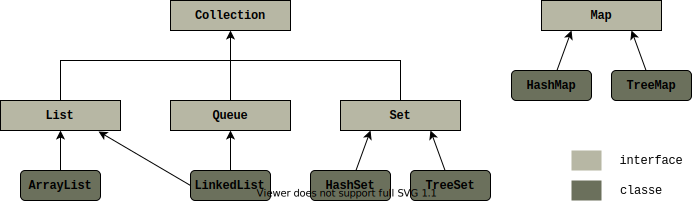

# Estudos de Java 11
Estudos de Java 11 baseados no livro **OCP Complete Study Guide**. Os títulos e subtítulos do livro foram mantidos em inglês para fácil localização no livro.


## Capítulo 14

### Using Lists, Sets, Maps and Queues

Uma *collection* é um objeto que agrupa outros objetos. Há quatro principais interfaces no *Framework* de  *Java 
Collections*:
* **List** — *collection* ordernada de elementos que permite entradas duplicadas;
* **Set** — *collection* de elementos que não permite duplicados;
* **Queue** — *collection* que organiza seus elementos numa ordem específica. Uma forma comum de uma *queue* 
  processar seus elementos é *first-in*, *first-out*;
* **Map** — *collection* que mapeia chaves, não duplicadas, para valores

Observe na figura abaixo o diagrama de herança entre essas interfaces no Java e algumas classes que as implementam



> `Map` não implementa `Collection`, mas continua sendo uma *collection* no sentido de que agrupa elementos

Primeiro vamos listar quais são os métodos declarados em `Collection`, consequentemente comum a todas as 
classes/interfaces que a implementam.

#### Common Collections Methods
O letra `E` que aparecerá nas assinaturas dos métodos abaixo, indica apenas um elemento genérico. Você pode saber 
mais na seção **Working with Generics**. Abaixo não estão listados todos os métodos da interface `Collection`, 
apenas os mais usuais.
* `boolean add(E element)` — adiciona um novo elemento;
* `boolean remove(Object object)` — remove um único elemento;
* `boolean isEmpty()` — verifica se a *collection* está vazia;
* `int size()` — retorna a quantidade de elementos; 
* `void clear()` — remove todos os elementos da *collection*;
* `boolean contains(Object object)` — verifica se determinando elemento está na *collection*;
* `boolean removeIf(Predicate<? super E> filter)` — remove todos os elementos cuja condição especificada é verdadeira;
* `void forEach(Consumer<? super T> action)` — itera por todos os elementos da *collection*. Uma observação a ser 
  colocada aqui é que esse é um método `default` da interface `Iterable`, que é estendida por `Collection`;
> É interessante notar que os métodos `remove` e `contains` recebem um `Object` como parâmetro, diferentemente dos 
> outros que estão parametrizados. Isso significa que você pode instanciar `Collection<String>`, mas passar 
> qualquer objeto para os métodos citados acima que não receberá erro de compilação ou execução.

#### Using the `List` Interface 
Uma lista é uma *collection* que permite **elementos duplicados e são ordenados**. Cada elemento possui um index, e os 
indexes começam em zero.

Das implementações de lista citadas na figura anterior, temos
- `ArrayList`:
  - é um *array* redimensionável;
  - o tempo que leva para acessar qualquer elemento é sempre o mesmo, ou seja, constante (*constant time*);
  - adicionar e remover elementos é uma operação mais lenta do que lê-los;
- `LinkedList`:
  - para elementos no começo ou no final da lista, ler, adicionar ou remover é em tempo constante;
  - para posições diferentes das citas acima, quanto maior for o index do elemento, maior tempo para acessá-lo

Criando `List` com métodos fábrica (*Factory methods*)

| Método                    | Descrição                                                       | Add elemento? | Substituir elemento? | Excluir elemento? |
|---------------------------|-----------------------------------------------------------------|:-------------:|:--------------------:|:-----------------:|
| `Arrays.asList(varargs)`  | Retorna uma lista que referencia um *array* não redimensionável |      Não      |         Sim          |        Não        |
| `List.of(varargs)`        | Retorna uma lista imutável                                      |      Não      |         Não          |        Não        |
| `List.copyOf(collection)` | Retorna uma lista imutável                                      |      Não      |         Não          |        Não        |
> Se você utilizar algum método que tente add ou remover elementos das listas, receberá em tempo de execução uma 
> `UnsupportedOperationException`. Para as imutáveis, substituir também lança a mesma exceção.

Em se tratando dos métodos da interface `List`, adicionamente a aqueles já definidos em `Collection`, temos
- `void add(int index, E element)` — **add** elemento na posição indicada e desloca os demais;
- `E set(int index, E element)` — **substitui** o elemento na posição indicada por um novo;
- `E get(int index)` — retorna o elemento da posição indica;
- `E remove(int index)` — remove o elemento da posição indicada e desloca os demais;
- `void replaceAll(UnaryOperator<E> op` — aplica em todos os elementos a operação indicada;
> Atenção ao usar `add(int, E)` e `set(int, E)`. Considere `List<String> list = new ArrayList<>()` para o nosso 
> exemplo e que as operações realizadas abaixo **não são realizadas em sequência**:
> - `list.add(1, "Book")` — lança `IndexOutOfBoundsException` em tempo de execução, pois o tamanho da lista é zero; 
> - `list.add(0, "Book")` — ok;
> - `list.set(0, "Book")` — lança `IndexOutOfBoundsException` em tempo de execução, pois o tamanho da lista é zero;

### Working with Generics

Genéricos surgiram para que o programador consiga parametrizar o tipo de dado com que ele deseja trabalhar. Por exemplo, a interface `List` por ser parametrizada como se segue:
```java
List<String> names = new ArrayList<>(); // só vai poder receber strings
names.add("Peter Parker"); // ok
names.add(new StringBuilder("Webbi")); // não compila
```
*Generics* não aceita tipos primitivos. Ex.: `List<int> numbers` não compila.

Convenção de nomes para *Generics*:
* `E` para um elemento;
* `K` para key de um map;
* `V` para valor de um map;
* `N` para um número;
* `T` para um tipo de dado genérico;
* `S`, `U`, `V` e assim por diante, para múltiplos tipos genéricos.

#### Generic Classes

Por baixo dos panos o compilador substitui as referências genéricas por um `Object`. Quando fazemos:
```java
public class Crate<T> {
    private T content;
    public T emptyCrate() {
        return content;
    }
}
```
o compilador na verdade está fazendo:
```java
public class Crate {
    private Object content;
    public Object emptyCrate() {
        return content;
    }
}
```
e add os necessários *casts* para o código funcionar:
```java
// Robot é uma classe definida qualquer
Crate<Robot> crate = new Crate<>();
Robot r = (Robot) crate.emptyCrate(); // (Robot) é add implicitamente pelo compilador 
```

#### Generic Interfaces

```java
public interface Shippable<T> {
    void ship(T t);
}
```

Você pode implementar essa interface de duas formas:
* Ex1. com uma classe concreta:
  ```java
  // Robot abaixo seria uma classe qualquer
  public class ShippableRobotCrate implements Shippable<Robot> {
      void ship(Robot t) { /*...*/ }
  }
  ```
* Ex2. com uma classe abstrata:
  ```java
  // não compila se você não parametrizar tbm ShippableCrate
  public abstract class ShippableCrate<T> implements Shippable<T> {
      @Override
      void ship(T t) { /*...*/ }
  }
  ```

#### Generic Methods

Antes do retorno do método, nós formalmente declaramos o tipo genérico `<T>` (*formal parameter type*). Lembrando que `<T>` pode ser qualquer letra.
```java
public class More {
    public static <T> void sink(T t) {/*...*/}
    public static <T> T identity(T t) { return t; }
    public static T noGood(T t) { return t; } // não compila pq o tipo genérico <T> não foi especificado
}
```

#### Bounding Generic Types

O livro descreve que um *bounded parameter type* é um tipo genérico que especifica uma restrição para os tipos de classes que determinado atributo `T` pode receber. 

O _**wildcard generic type**_ é representado pelo sinal de interrogação `?`.

Tipos de bounds:
| Tipo de bound | Sintaxe | Exemplo |
| ------------- | ------ | ------- |
| Unbounded wildcard | `?` | `List<?> l = new ArrayList<String>();` |
| Wildcard with an upper bound | `? extends type` | `List<? extends Exception> l = new ArrayList<RuntimeException>();` |
| Wildcard with a lower bound | `? super type` | `List<? super Exception> l = new ArrayList<Object>();` |


##### Unbounded Wildcards

Representa qualquer tipo de dado. Vamos a um exemplo:
```java
public static void printList(List<Object> list) {
    for (Object x : list)
        System.out.println(x);
}
public static void main(String[] args) {
    List<String> keywords = new ArrayList<>();
    keywords.add("java");
    printList(keywords); /* não compila. Apesar de String ser uma subclass de Object,
    List<String> != List<Object>. Na chamada de printList(...) estamos tentando fazer 
    List<Object> list = keywords */
}
```
Para resolver o problema acima podemos fazer uso do caracter `?`:
```java
// agora lista pode receber qualquer classe.
public static void printList(List<?> list) {
    for (Object x : list)
        System.out.println(x);
}
public static void main(String[] args) {
    List<String> keywords = new ArrayList<>();
    keywords.add("java");
    printList(keywords); // ok
}
```

Obs.: no exemplo abaixo as duas declarações não são equivalentes:
```java
List<?> x1 = new ArrayList<>(); // x1 é do tipo List
var     x2 = new ArrayList<>(); // x2 é do tipo ArrayList
```

##### Upper-Bounded Wildcards

Vamos a uma tentativa de criar uma lista de números:
```java
List<Number> list = new ArrayList<Integer>(); // não compila, pelo motivo que já vimos acima
```
para resolver o problema acima podemos utilizar o *upper-bounded wildcard*:
```java
List<? extends Number> list = new ArrayList<Integer>(); // ok
```
acima estamos dizendo que qualquer classe que `extends` de `Number` ou a própria `Number` pode ser utilizada como parâmetro do *generics*.

**Obs.:** trabalhar com listas com *upper-bounded* ou *unbounded wildcard* **a torna imutável** para adicionar elementos:
```java
List<? extends Number> list = new ArrayList<>(List.of(1, 5, 5)); // ok
list.add(20); // não compila
list.remove(2); // ok, remover é permitido
```
##### Lower-Bounded Wildcards

Considere o método abaixo:
```java
public static void addTen(List<? super Integer> list) {
    list.add(10); // compila ok
}
```
Utilizar *lower-bounded* resolve o problema da imutabilidade como observado o método acima, pois o Java considera seguro uma vez que haverá no mínimo um `Integer`. Veja abaixo:
```java
List<Integer> integers = new ArrayList<>();
integers.add(12);
addTen(integers); // ok

List<Number> numbers = new ArrayList<>();
numbers.add(234);
numbers.add(2.5);
addTen(numbers); // ok
```